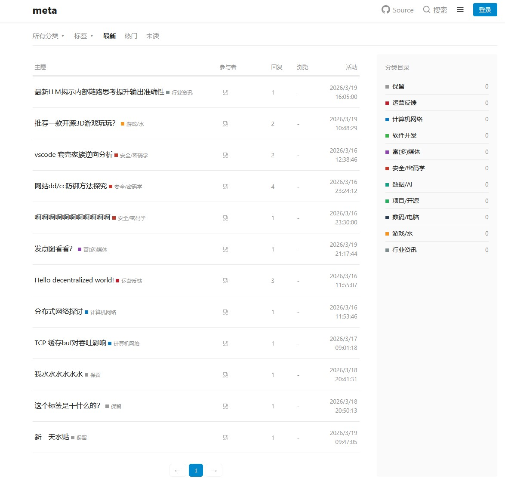

# kepweb-multi

kep webUI-multi程序，允许多用户共用一个节点。

现实现为所有用户一个mainkey，以pkey区分用户，可能此实现不符合协议初衷

使用cname泛解析实现过 原始kep协议txt验证

 

### 注意：
此程序未做过过多测试。由潜在bug造成的任何问题，自己承担bug风险

 

---

## 效果展示

---

## 提示:

推荐使用单用户设计主题[kepweb](https://github.com/stalltrix/kepweb)项目。

当前如无特殊必要，尽量不要使用多用户webUI，

如果只是觉得UI好看，kepweb-multi与kepweb的后端接口API是相同的，理论上两者的前端主题（即：**ui.html**）是可以互相替换的（更改一下url重写路径就行）。

 

kepweb-multi现在只保证编译正常，前端展示无明显异常，由于开发精力问题，以及核心开发者对此不感兴趣，并未做过过多测试。