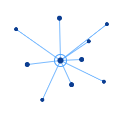

# kepweb-multi

<div align="center">
  
</div>


[](https://pkg.go.dev/github.com/stalltrix/kepweb-multi)
[](https://github.com/stalltrix/kepweb-multi/releases)
[](https://github.com/stalltrix/kepweb-multi/blob/master/LICENSE)

kep webUI-multi程序，允许多用户共用一个节点。

现实现为所有用户一个mainkey，以pkey区分用户，可能此实现不符合协议初衷

使用cname泛解析实现过 原始kep协议txt验证

<br>

### 注意：
此程序未做过过多测试。由潜在bug造成的任何问题，自己承担bug风险

<br>

---

## 效果展示


---

<br>

## 安装教程

#### 注意，kepweb-multi 从v0.2.0版本开始，依赖mysql兼容数据库（例如mariadb-10.x）

### 1.安装edge主程序

安装[kep-edge](https://github.com/stalltrix/kep-demo)项目，在相同目录安装并启动程序。配置api_token以及local_token，后续kepweb-multi程序使用

### 2.安装mysql兼容数据库

下载解压安装mysql兼容数据库，添加一个表‘userkepdb'，创建管理员账户，参考[sql.cmd](sql.cmd)。创建管理员也可使用`kepweb-multi -cli`快捷命令

### 3.安装kepweb-multi程序

参考[config.json](config.json)进行配置文件。启动kepweb-multi程序

config.json最小配置

```json
{
	"sql_ip": "127.0.0.1:3306",
	"sql_auth": "root:123456",
	"keyfile": "keydata",
	"ntp": "time.cloudflare.com",
	"api_token": "[your kep-edge api_token]",
	"listen": "127.0.0.1:3000",
	"neighbors": [
		{
			"url": "http://127.0.0.1:8080",
			"token": "[your kep-edge local_token]"
		}
	]
}
```

---

<br>

## 提示:

推荐使用单用户设计主题[kepweb](https://github.com/stalltrix/kepweb)项目。

当前如无特殊必要，尽量不要使用多用户webUI，

如果只是觉得UI好看，kepweb-multi与kepweb的后端接口API是相同的，理论上两者的前端主题（即：**ui.html**）是可以互相替换的（更改一下url重写路径就行）。

<br>

kepweb-multi现在只保证编译正常，前端展示无明显异常，由于开发精力问题，以及核心开发者对此不感兴趣，并未做过过多测试。